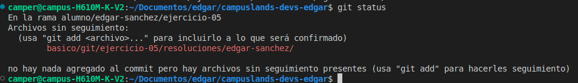
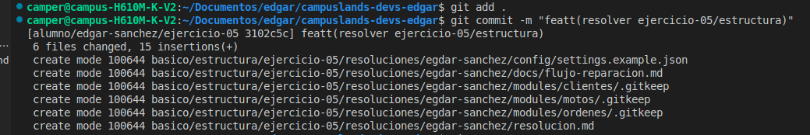
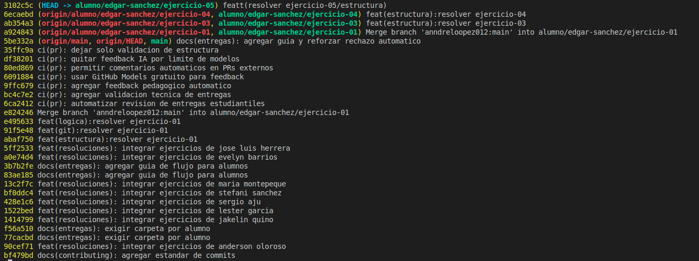

# RESOLUCION EJERCICIO-05 GIT
## Desarrollador:
Edgar Manolo Polanco Sáchez

### Explicacion de los distintos camndos:
### (`git status`):
Muestra el estado del directorio de trabajo (archivos modificados, agregados o no rastreados).

### (`git add .`):
Añade cambios al área de preparación (staging area). Usar git add . añade todos los cambios.

### (`git commit "mensaje" `):
Guarda los cambios del área de preparación en el historial del repositorio.

### (`git log`)
Muestra el historial de commits registrados.

